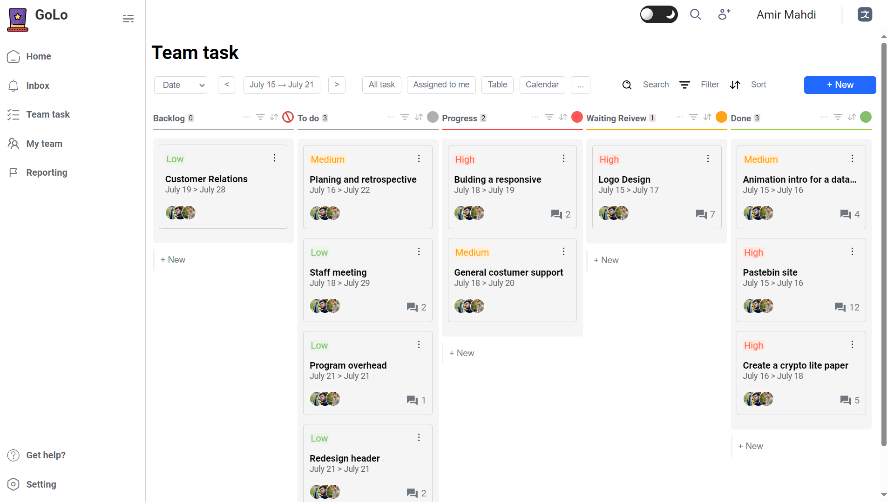

# Golo - Task Manager Application

## Description

Golo is a simple yet powerful Task Manager application developed using HTML, CSS, and JavaScript. Designed with a responsive layout, Golo ensures an optimal user experience across various devices. The application allows users to manage their tasks efficiently, organize their to-do lists, and enhance productivity with several modern features.

## Features

- **Create and Manage Tasks:** Add, edit, and delete tasks with ease.
- **Dark/Light Mode:** Switch between dark and light themes for comfortable viewing at any time.
- **Drag and Drop Functionality:** Easily reorder tasks by dragging and dropping them in your preferred order.
- **Responsive Design:** Works seamlessly on desktops, tablets, and mobile devices.
- **User-friendly Interface:** Intuitive layout for easy navigation and task management.
- **Task Status:** Mark tasks as complete or incomplete to help manage your workload.
- **Sorting and Filtering:** Organize tasks by date, priority, or status for improved workflow.

## Technologies Used

- **HTML5**: For structuring the web pages.
- **CSS3**: For styling and layout design.
- **JavaScript**: For implementing interactivity and functionality.
- **Responsive Design**: Utilizes media queries for an optimal viewing experience.

## Getting Started

To get a copy of Golo up and running on your local machine, follow these simple steps:

1. **Clone the Repository**:

```bash
git clone https://github.com/yourusername/golo.git
```

## Usage

To use the Golo Task Manager application, follow these steps:

1. **Adding a Task**:

   - Enter your task in the input field located at the top of the application.
   - Click on the "Add Task" button. Your task will appear in the list below.

2. **Editing a Task**:

   - Click on the edit icon (✏️) next to the task you wish to modify.
   - Update the task details and click "Save".

3. **Deleting a Task**:

   - Click on the delete icon (🗑️) next to the task you want to remove.
   - Confirm deletion if prompted.

4. **Toggling Task Status**:

   - Click on the checkbox next to a task to mark it as complete or incomplete.

5. **Changing Themes**:

   - Click on the theme toggle switch at the top to switch between dark and light modes.

6. **Reordering Tasks**:
   - You can drag and drop tasks to rearrange them according to your preferences.

## Screenshots



## Contributing

Contributions to Golo are welcome! If you would like to contribute, please follow these steps:

1. **Fork the Repository**: Click on the fork button at the top right of the repository page.
2. **Clone Your Fork**:

   ```bash
   git clone https://github.com/yourusername/golo.git


   ```

### License

```markdown
## License

This project is licensed under the MIT License.

```

## Author

- [AmirMahdi Soleimani](https://github.com/theAmirMahdi)
- Feel free to reach out to me on [LinkedIn](https://www.linkedin.com/in/amirmahdi-soleimani-b65887303/?utm_source=share&utm_campaign=share_via&utm_content=profile&utm_medium=ios_app) for any inquiries.

## Acknowledgements

- Inspiration from various task management tools that guided the design and functionality of Golo.
- Additional libraries and frameworks that contributed to the development (e.g., Bootstrap, jQuery, etc.).
